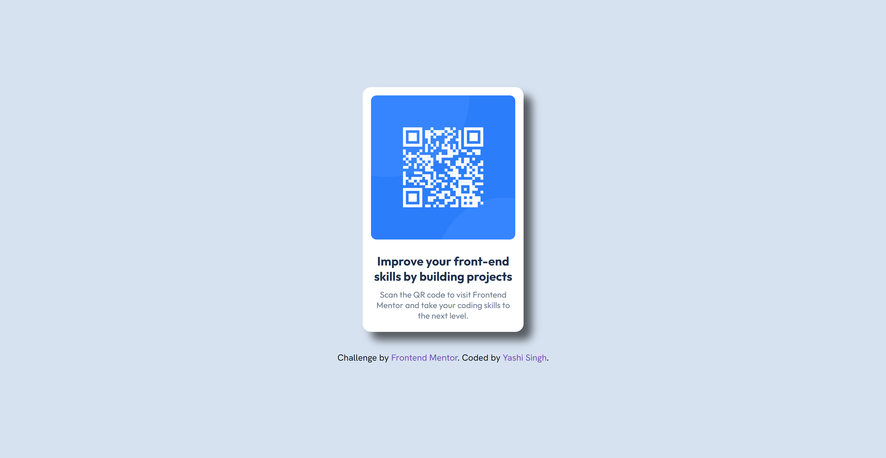
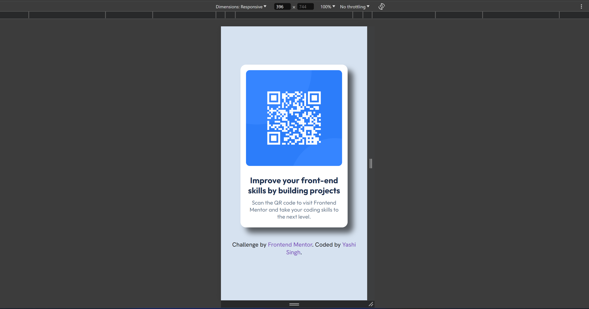

# Frontend Mentor - QR Code Component Solution

## Description

This project is a simple and elegant QR Code Component challenge provided by [Frontend Mentor](https://www.frontendmentor.io/challenges/qr-code-component-iux_sIO_H). It is a responsive webpage that displays a QR code, which links to the Frontend Mentor website. The purpose of this challenge is to enhance front-end development skills by building a straightforward yet visually appealing UI component.

## Live Demo

You can view the **live demo** of this project [here](https://qr-code-component-by-yashi.netlify.app/).

## Badges

 
[](https://app.netlify.com/sites/qr-code-component-by-yashi/deploys)


## Visuals

Here is a preview of the QR Code Component:





## Installation

To run this project locally, follow these steps:

1. Clone the repository:

    ```bash
    git clone https://github.com/Yashi-Singh-9/QR-Code-Component.git
    ```

2. Navigate to the project directory:

    ```bash
    cd QR-Code-Component
    ```

3. Open the `index.html` file in your browser:

    ```bash
    open index.html
    ```

## Usage

The QR Code Component is a static webpage. Simply open the `index.html` file in any modern web browser, and you'll see the QR code that links to the Frontend Mentor website. This component can be embedded into other projects or used as a standalone page.

## Support

If you have any questions or run into any issues, feel free to reach out:

- [Frontend Mentor Challenge](https://www.frontendmentor.io/challenges/qr-code-component-iux_sIO_H)
- [Yashi Singh's LinkedIn](https://www.linkedin.com/in/yashi-singh-b4143a246)

## Roadmap

Currently, this project is complete as per the challenge requirements. However, future enhancements could include:

- Adding animations to the QR code.
- Enhancing the design with additional styling or visual effects.
- Making the component interactive by adding JavaScript functionality.

## Contributing

Contributions are welcome! If you'd like to improve this project, feel free to fork the repository and submit a pull request. Here’s how you can do it:

1. Fork the repository.
2. Create a new branch for your feature (`git checkout -b feature-branch`).
3. Make your modifications and commit them (`git commit -m 'Add a new feature'`).
4. Push to the branch (`git push origin feature-branch`).
5. Open a pull request to the main branch.

## Authors and Acknowledgment

- **Author:** Yashi Singh
- **Acknowledgment:** Special thanks to [Frontend Mentor](https://www.frontendmentor.io) for providing this challenge and resources to improve front-end development skills.

## License

This project is licensed under the MIT License - see the [LICENSE](LICENSE) file for details.
