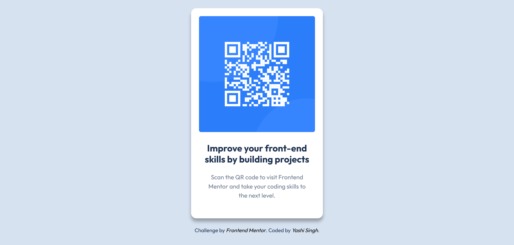

# Frontend Mentor - QR Code Component Solution

## Overview

✨✨✨ This project is a solution to the [QR Code Component Challenge](https://www.frontendmentor.io/challenges/qr-code-component-iux_sIO_H) from Frontend Mentor. It features a responsive webpage showcasing a simple yet elegant QR code design, linking to the Frontend Mentor website. The primary goal of this challenge is to improve front-end development skills by creating a visually appealing and accessible UI component. ✨✨✨

## Live Demo

✨✨✨ View the **live demo** of the project here: [QR Code Component](https://yashi-singh-9.github.io/QR-Code-Component/) ✨✨✨

## Features

- **Responsive Design:** Fully responsive layout optimized for both desktop and mobile devices.
- **Clean Code:** Built with semantic HTML5, SCSS, and Bootstrap for maintainability and modularity.
- **Typography:** Integrated Google Fonts for professional and modern typography.
- **Custom Styling:** SCSS variables and mixins are used for reusable styles and easy theme management.

## Technologies Used

✨✨✨ - **HTML5:** For structuring the content.
- **SCSS:** For enhanced and modular styling.
- **Bootstrap:** For quick and responsive layout design. ✨✨✨

## Visuals

✨✨✨ Below are previews of the project design: ✨✨✨

### Desktop Preview


### Mobile Preview


## How to Run Locally

✨✨✨ Follow these steps to set up the project on your local machine: ✨✨✨

1. **Clone the Repository:**
    ```bash
    git clone https://github.com/Yashi-Singh-9/QR-Code-Component.git
    ```

2. **Navigate to the Project Directory:**
    ```bash
    cd QR-Code-Component
    ```

3. **Open the Project in a Browser:**
    ```bash
    open index.html
    ```

## Folder Structure

✨✨✨

```
QR-Code-Component/
|-- images/           # Images used in the project
|-- styles.scss       # SCSS file for custom styling
|-- styles.css        # Compiled CSS file
|-- index.html        # HTML structure
|-- README.md         # Project documentation
``` 

✨✨✨

## Usage

✨✨✨ The QR Code Component is a static webpage that can be used as a standalone UI component or embedded into larger projects. Simply open the `index.html` file in any modern browser to view the component. ✨✨✨

## Roadmap

✨✨✨ Potential future improvements include: ✨✨✨

- Adding hover and focus effects to make the component more interactive.
- Including animations for the QR code to enhance user engagement.
- Extending the design with a dark mode toggle.

## Contributing

✨✨✨ Contributions are welcome! Here’s how you can contribute: ✨✨✨

1. **Fork the Repository:**
2. **Create a Feature Branch:**
    ```bash
    git checkout -b feature-name
    ```
3. **Make Changes:** Commit your updates with a clear description.
4. **Push Changes:**
    ```bash
    git push origin feature-name
    ```
5. **Submit a Pull Request:** Open a pull request to the main branch.

## Acknowledgments

✨✨✨ 
- **Challenge by:** [Frontend Mentor](https://www.frontendmentor.io)
- **Coded by:** [Yashi Singh](https://www.linkedin.com/in/yashi-singh-b4143a246) 
✨✨✨

## License

✨✨✨ This project is licensed under the MIT License. See the [LICENSE](LICENSE) file for more information. ✨✨✨

---

✨✨✨ Thank you for checking out my solution! Feel free to share your feedback or ask any questions. ✨✨✨